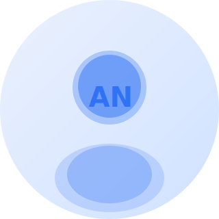
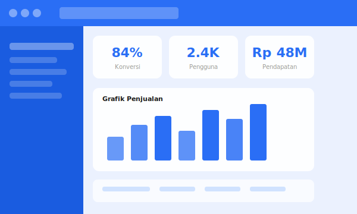

🗂️ Portofolio Website — Panduan Penggunaan

Website portofolio minimalis berbasis HTML, CSS, dan JavaScript murni. Tidak memerlukan framework atau build tool — cukup buka di browser.

---

📁 Struktur Folder

```
portfolio/
├── index.html              ← Halaman utama
├── style.css               ← Semua styling
├── script.js               ← Interaksi & animasi
└── assets/
    ├── images/
    │   ├── avatar.svg      ← Foto profil (ganti dengan foto Anda)
    │   ├── project1.svg    ← Thumbnail proyek 1
    │   ├── project2.svg    ← Thumbnail proyek 2
    │   └── project3.svg    ← Thumbnail proyek 3
    └── icons/
        ├── skill-uiux.svg
        ├── skill-frontend.svg
        ├── skill-mobile.svg
        ├── skill-research.svg
        ├── skill-designsystem.svg
        └── skill-performance.svg
```

---

🚀 Cara Menjalankan

1. Download dan ekstrak file `portfolio.zip`
2. Buka folder hasil ekstrak
3. Double-klik `index.html` — langsung terbuka di browser

> Tidak perlu server lokal, instalasi, atau koneksi internet (kecuali untuk font Google Fonts).

---

✏️ Cara Kustomisasi

1. Ganti Nama & Informasi Pribadi

Buka `index.html`, cari dan ganti bagian berikut:

```html
<!-- Nama di hero -->
<h1 class="hero-name">Andi Nugraha</h1>

<!-- Jabatan/profesi -->
<p class="hero-title">UI/UX Designer & Front-End Developer</p>

<!-- Badge status -->
<div class="hero-badge">Tersedia untuk proyek</div>
```

Ganti juga di bagian About:

```html
<p class="about-text">
  Halo! Saya Andi, seorang desainer ...
</p>
```

Dan di Footer untuk kontak:

```html
<li><a href="mailto:andi@email.com">andi@email.com</a></li>
<li><a href="tel:+628123456789">+62 812-3456-789</a></li>
<li><a href="">Bandung, Jawa Barat</a></li>
```

---

2. Ganti Foto Profil

Simpan foto Anda (`.jpg` atau `.png`) ke dalam folder `assets/images/`, lalu di `index.html` ganti:

```html
<!-- Sebelum -->


<!-- Sesudah -->

```

> Ukuran foto ideal: minimal 300×300px, format persegi (1:1) agar tidak terpotong.

---

3. Edit Statistik (About)

Di `index.html`, temukan bagian `.about-stats`:

```html
<div class="stat-card">
  <div class="stat-num">4+</div>
  <div class="stat-label">Tahun pengalaman</div>
</div>
```

Ganti angka dan labelnya sesuai data Anda.

---

4. Edit Kartu Skill

Setiap skill memiliki struktur seperti ini:

```html
<div class="skill-card">
  <div class="skill-icon">
    
  </div>
  <div class="skill-name">UI/UX Design</div>
  <p class="skill-desc">Deskripsi singkat skill ini...</p>
</div>
```

Untuk mengganti ikon skill:
- Simpan gambar ikon (`.png` atau `.svg`) ke `assets/icons/`
- Ubah `src` pada tag `` di dalam `.skill-icon`
- Ukuran ideal: 52×52px

Untuk menambah skill baru, salin satu blok `<div class="skill-card">` dan tempelkan di dalam `.skills-grid`, lalu edit isinya.

Untuk menghapus skill, hapus seluruh blok `<div class="skill-card">...</div>`.

---

5. Edit Proyek

Setiap proyek memiliki struktur:

```html
<div class="project-card">
  <div class="project-thumb">
    
  </div>
  <div class="project-body">
    <span class="project-tag">Web App</span>
    <p class="project-name">Nama Proyek</p>
    <p class="project-desc">Deskripsi singkat proyek ini.</p>
    <a href="" class="project-link">Lihat proyek →</a>
  </div>
</div>
```

- Thumbnail — simpan screenshot proyek ke `assets/images/`, ganti `src`-nya. Ukuran ideal: 600×360px
- Tag — ganti label seperti `Web App`, `Mobile`, `Branding`, dll.
- Link proyek — ganti `href=""` dengan URL proyek nyata Anda (GitHub, Figma, live demo, dll.)

---

6. Ganti Link Sosial Media

Di bagian footer, ganti `href=""` pada setiap tombol sosial:

```html
<a href="https://linkedin.com/in/username" class="social-btn" aria-label="LinkedIn">in</a>
<a href="https://github.com/username"      class="social-btn" aria-label="GitHub">gh</a>
<a href="https://instagram.com/username"   class="social-btn" aria-label="Instagram">ig</a>
<a href="https://dribbble.com/username"    class="social-btn" aria-label="Dribbble">dr</a>
```

---

7. Ubah Warna Tema

Semua warna diatur lewat variabel CSS di bagian atas `style.css`:

```css
:root {
  --bg:           F7F6F2;  /* Warna latar halaman */
  --surface:      FFFFFF;  /* Warna kartu/panel */
  --ink:          1A1A18;  /* Warna teks utama */
  --ink-2:        5A5A54;  /* Warna teks sekunder */
  --accent:       2A6EF5;  /* Warna aksen/biru */
  --accent-light: EBF1FE;  /* Warna aksen muda */
}
```

Cukup ganti nilai hex-nya untuk mengubah seluruh palet warna sekaligus.

---

8. Ubah Judul Tab Browser

Di `index.html` baris pertama `<head>`:

```html
<title>Portofolio — Andi Nugraha</title>
```

Ganti dengan nama Anda.

---

🌐 Cara Deploy (Upload ke Internet)

Opsi A — GitHub Pages (Gratis)
1. Buat akun di [github.com](https://github.com)
2. Buat repository baru, upload semua file dari folder `portfolio/`
3. Masuk ke Settings → Pages, pilih branch `main`, folder `/ (root)`
4. Website Anda akan live di `https://username.github.io/nama-repo`

Opsi B — Netlify (Gratis, Lebih Mudah)
1. Buka [netlify.com](https://netlify.com) dan daftar
2. Drag-and-drop folder `portfolio/` ke dashboard Netlify
3. Website langsung live dalam hitungan detik

Opsi C — Hosting Biasa
Upload semua file ke folder `public_html` atau `www` di hosting Anda via FTP atau File Manager cPanel.

---

🛠️ Kustomisasi Lanjutan (CSS)

| Yang Ingin Diubah | Cari di `style.css` |
|---|---|
| Ukuran foto profil | `.hero-photo` → `width` dan `height` |
| Jumlah kolom skill | `.skills-grid` → `minmax(200px, 1fr)` |
| Jumlah kolom proyek | `.projects-grid` → `minmax(280px, 1fr)` |
| Tinggi thumbnail proyek | `.project-thumb` → `height` |
| Font judul | Selector `font-family: 'Syne'` |
| Font isi | Selector `font-family: 'Inter'` |

---

❓ Pertanyaan Umum

Font tidak muncul?
Website menggunakan Google Fonts. Pastikan ada koneksi internet saat pertama kali dibuka. Setelah itu font akan ter-cache oleh browser.

Gambar tidak muncul?
Pastikan nama file dan path di `src="..."` sama persis dengan nama file di folder `assets/`. Nama file bersifat *case-sensitive* di server Linux.

Form kontak tidak mengirim email?
Form saat ini hanya menampilkan notifikasi browser. Untuk pengiriman email nyata, integrasikan dengan layanan seperti [Formspree](https://formspree.io) atau [EmailJS](https://emailjs.com) — keduanya gratis untuk penggunaan dasar.

---

📄 Lisensi

Bebas digunakan dan dimodifikasi untuk keperluan pribadi maupun komersial.
